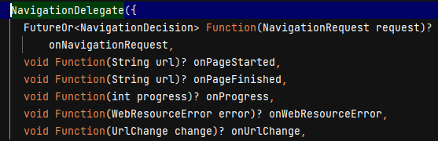

# webview_flutter_package

A new Flutter project.

## Getting Started

This project is a starting point for a Flutter application.

A few resources to get you started if this is your first Flutter project:

- [Lab: Write your first Flutter app](https://docs.flutter.dev/get-started/codelab)
- [Cookbook: Useful Flutter samples](https://docs.flutter.dev/cookbook)

For help getting started with Flutter development, view the
[online documentation](https://docs.flutter.dev/), which offers tutorials,
samples, guidance on mobile development, and a full API reference.

## 1. Research: Webview Flutter Package

- Keywords:
    - WebView flutter package
    - webview flutter example
    - flutter webview-example github
    - flutter webview-example github
    - flutter webview web
    - flutter webview full screen
    - flutter webview pro
    - Webview flutter example github
    - inappwebview flutter example
    - flutter webview source code
    - webviewcontroller flutter
    - in-app webview flutter
    - flutter webview windows
    - flutter webview example 2023
    - flutter open url in webview
    - flutter webview-example github
    - flutter webview web example
    - flutter webview web tutorial
    - flutter inappwebview
    - flutter webview full screen
    - webview in flutter app
- Video Title: WebView Flutter Package | In-app WebView with full screen in Flutter | Convert
  website into app

## 2. Research: Competitors

**Flutter Videos/Articles**

- 50K: https://youtu.be/FrqGGw9DYfs
- 171K: https://youtu.be/RA-vLF_vnng
- 1.4K: https://youtu.be/7Ig45s2251I
- 5.2K: https://youtu.be/yoSoxy4LIRg
- 9.6K: https://youtu.be/iNOhiVjS88c
- 70K: https://youtu.be/5u3pZZ6uvDo
- 2.5K: https://youtu.be/2_Q6xfVsmJM
- 45K: https://youtu.be/Wo0o0wSkn4k
- 10K: https://youtu.be/mgHrIV1Qgmc
- 58K: https://youtu.be/LyAwnwvbBKM
- 18K: https://youtu.be/SyDo0GqBVYU
- 10K: https://youtu.be/TfJQP4FM47k
- https://pub.dev/packages/webview_flutter
- https://codelabs.developers.google.com/codelabs/flutter-webview
- https://www.tutorialkart.com/flutter/flutter-webview/
- https://chromium.googlesource.com/external/github.com/flutter/plugins/+/refs/tags/connectivity-v2.0.1/packages/webview_flutter
- https://dev-yakuza.posstree.com/en/flutter/webview_flutter/
- https://medium.com/@ekosuprastyo15/webview-in-flutter-example-a11a24eb617f
- https://www.kindacode.com/article/flutter-webview/
- https://blog.logrocket.com/render-webpages-using-flutter-webview/

**Android/Swift/React Videos**

- 23K: https://youtu.be/JlmIf8mo-O8
- 332K: https://youtu.be/TUXui5ItBkM
- 78K: https://youtu.be/6U8-_G5yjwA
- 1.9K: https://youtu.be/EkKdQ6gVzao
- 15K: https://youtu.be/GaXgDy0rRv8
- 61K: https://youtu.be/JafGypqFvs4
- 2.2K: https://youtu.be/Ntkt06bD698
- 10K: https://youtu.be/GyWeDBkatlc
- 3.4K: https://youtu.be/d5fMOEodxc4
- 31K: https://youtu.be/0lN0RnOWTlI
- 20K: https://youtu.be/yiZZeK-y6cI
- https://developer.android.com/develop/ui/views/layout/webapps/webview
- https://www.tutorialspoint.com/android/android_webview_layout.htm
- https://abhiandroid.com/ui/webview
- https://www.geeksforgeeks.org/how-to-use-webview-in-android/
- https://developer.apple.com/documentation/webkit/wkwebview
- https://www.hackingwithswift.com/read/4/2/creating-a-simple-browser-with-wkwebview
- https://www.tutorialspoint.com/how-to-create-a-webview-in-an-ios-app-using-swift
- https://www.javatpoint.com/ios-webview
- https://reactnative.dev/docs/0.61/webview
- https://www.npmjs.com/package/react-native-webview
- https://blog.logrocket.com/react-native-webview-a-complete-guide/
- https://docs.expo.dev/versions/latest/sdk/webview
- https://www.tutorialspoint.com/react_native/react_native_webview.htm
- https://www.javatpoint.com/react-native-webview

**Great Features**

- This plugin provides a WebView widget on Android and iOS.
- Find more features
  at [https://pub.dev/packages/webview_flutter](https://pub.dev/packages/webview_flutter).

**Problems from Videos**

- Question: How to solve error 'net::ERR_CACHE_MISS' in production mode?

Answer:  Follow
this [link](https://stackoverflow.com/questions/60829199/flutter-webviews-gives-neterr-cache-miss-message)

- Question: Error 'ERR_CONNECTION_REFUSED'

Answer: Follow
this [link](https://stackoverflow.com/questions/55785581/socketexception-os-error-connection-refused-errno-111-in-flutter-using-djan)

- Question: How to get push notifications with webview?

Answer: Follow this [link](https://github.com/bobanminic96/push_notifications)

- Question: How to enable full video landscape in webview?

Answer: Follow
this [link](https://stackoverflow.com/questions/64290230/flutter-webview-video-player-not-auto-rotating-as-observe-in-android-chrome)

- Question: is there any way to use read-mode in webview?

Answer: Follow
this [link](https://stackoverflow.com/questions/62471299/reader-mode-for-webview-in-flutter)

- Question: How to implement autofill fields?

Answer: Follow
this [link](https://medium.com/swlh/how-to-implement-autofill-in-your-flutter-app-b43bddab1a97)

**Problems from Flutter Stackoverflow**

- https://stackoverflow.com/questions/74847502/why-cant-i-use-webview-in-flutter-dart
- https://stackoverflow.com/questions/75823597/an-issue-with-flutter-webview-widget
- https://stackoverflow.com/questions/72386529/getting-error-while-implementing-web-view-in-flutter-applications
- https://stackoverflow.com/questions/75782448/flutter-issue-in-webview-method-flutter

## 3. Video Structure

**Main Points / Purpose Of Lesson**

1. In this video lesson, you will learn how to convert website into app using webview flutter
   package.
2. WebViewController is the main thing in webview flutter package. Through this following methods
   can be used:
    - setJavaScriptMode
    - loadRequest
    - setBackgroundColor
    - setNavigationDelegate
3. HTML, CSS, and Javascript code can also be run through webview controller.

**The Structured Main Content**

1. Run `dart pub add webivew_flutter` package in terminal to add webview_flutter package in your
   project's pubspec.yaml file.
2. `main.dart` file contains theming properties. `home` property of `MaterialApp` is calling
   HomePage from `home_page.dart`
3. `home_page.dart` contains one elevated button. By clicking on that button, `WebViewPage`
   from `webview_page.dart` is opened.
4. `webview_page.dart` file contains WebView widget that converts any website into app using this
   package.
    - First, initialize `webViewController`:

```dart
late final WebViewController webViewController;

class WebViewPageState extends State<WebViewPage> {

  @override
  void initState() {
    super.initState();
    webViewController = WebViewController()
      ..setJavaScriptMode(JavaScriptMode.unrestricted)
      ..setBackgroundColor(Colors.white)
      ..setNavigationDelegate(
        NavigationDelegate(
          onPageStarted: (url) => debugPrint('Page started loading: $url'),
          onPageFinished: (url) => debugPrint('Page finished loading: $url'),
          onUrlChange: (change) => debugPrint('url changed to ${change.url}'),
          onProgress: (progress) =>
              debugPrint('WebView is loading (progress : $progress%)'),
          onWebResourceError: (error) =>
              debugPrint('Page resource error code: ${error.errorCode}'),
          onNavigationRequest: (request) {
            if (request.url.startsWith('https://www.facebook.com')) {
              debugPrint('blocking navigation to ${request.url}');
              return NavigationDecision.prevent;
            }
            return NavigationDecision.navigate;
          },
        ),
      )
      ..loadRequest(Uri.parse('https://heyflutter.com'));
  }
}
```

- Double dots make a sequence of operations on the same object which is WebViewController here.
- `setJavaScriptMode` sets the JavaScript execution mode to be used by the WebView.
- `setBackgroundColor` sets the current background color of this view.
- `setNavigationDelegate` uses `NavigationDelegate` widget containing the callback methods that are
  called during navigation events.
- `loadRequest` loads new request with the provided url.
- `NavigationDelegate` has following properties:
    - `onPageStarted` is called when new url starts loading.
    - `onPageFinished` is called when old url is finished and new url starts loading.
    - `onProgress` is called when new url starts loading, it shows percentage.
    - `onWebResourceError` is called when web view has error.
    - `onNavigationRequest` is called when navigation changes.
    - `onUrlChange` is called when web view changes to a new url.

      

- Body of `webview_page.dart` is following:

```dart
class WebViewPageState extends State<WebViewPage> {
  @override
  Widget build(BuildContext context) =>
      WillPopScope(
        onWillPop: onWillPop,
        child: Scaffold(
          appBar: AppBar(
            title: const Text('WebView Page'),
          ),
          body: WebViewWidget(controller: webViewController),
          floatingActionButton: FloatingActionButton(
            onPressed: () =>
                webViewController
                    .loadRequest(Uri.parse('https://www.youtube.com')),
            child: const Icon(Icons.import_export, size: 32),
          ),
        ),
      );
}

Future<bool> onWillPop() async {
  if (await webViewController.canGoBack()) {
    webViewController.goBack();
    return false;
  } else {
    return true;
  }
}
```

- `FloatingActionButton` is used to loadRequest (change webView url) from heyflutter.com to
  youtube.com.
- `WillPopScope` is used to control the back navigation button of android. If we can go back in url
  where are `webViewController.canGoBack()` then it will go back `webViewController.goBack()` and
  return false otherwise it will return true.